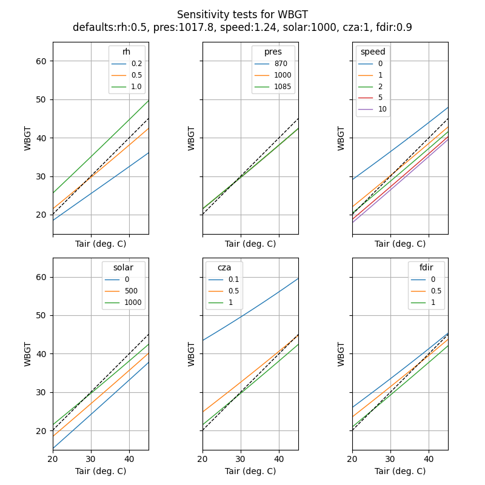

# wbgt

This code is a python wrapper around Liljegren's original C code.
Builds on [work by Max Lieblich, University of Washington, 2016](https://github.com/mdljts/wbgt), who modernized the original code so that it interfaces nicely with R (or python's ctypes).

This python package can be used to estimate wet bulb globe temperature (WBGT) from datasets of standard meterological measurements using models developed by Liljegren et al (1).
See documentation in [the original repository](https://github.com/mdljts/wbgt).

Sensitivity test (see [notebook](wbgt.ipynb)):

This readme focuses on modifications made since it was forked. I only keep the references at the end.

### Install

git clone and python setup.py install or:

pip install git+https://github.com/perrette/wbgt.git

### Functions available in the wbgt module

The functions below are very thin wrappers around the original C code using ctypes.
See [original C code](src/wbgt.c) for documention.

#### wbgt(tk, rh, pres, speed, solar, fdir, cza): Tg, Tnwb, Tpsy, WBGT

This is simplified function of calc_wbgt, which takes actual wind speed, solar radiation, cos azimuth angla and fraction of direct irradiance directly
What it leaves out:

-   conversion to degC to Kelvin (expected inputs are in K, for consistency with other functions)
-   conversion of relhum (%) to rh (fraction, for consistency with other functions)
-   calculation of solar, fdir, cza, for greater modularity (e.g. always calculate max wbgt at noon...) and to use sun from climate models (see calc_solar_parameters)
-   conversion of wind speed at arbitrary height to 2-m wind speed (see estimate_windspeed)

#### calc_solar_parameters(year, month, dday, lat, lon, solar): solar, cza, fdir

#### solarposition(year, month, day, days_1900, latitude, longitude): ap_ra, ap_dec, altitude, refraction, azimuth, distance

#### estimate_windspeed(zspeed, speed, solar, dT, cza, urban) : wind speed at 2 m

### References

1. Liljegren JC, Carhart RA, Lawday P, Tschopp S, Sharp R. Modeling the wet bulb globe temperature using standard meteorological measurements. J Occup Environ Hyg. 2008;5(10):645-55.
2. Yaglou CP, Minard D. Control of heat casualties at military training centers. AMA Arch Ind Health. 1957;16(4):302-16.
3. Lemke B, Kjellstrom T. Calculating workplace WBGT from meteorological data: a tool for climate change assessment. Ind Health. 2012;50(4):267-78.
